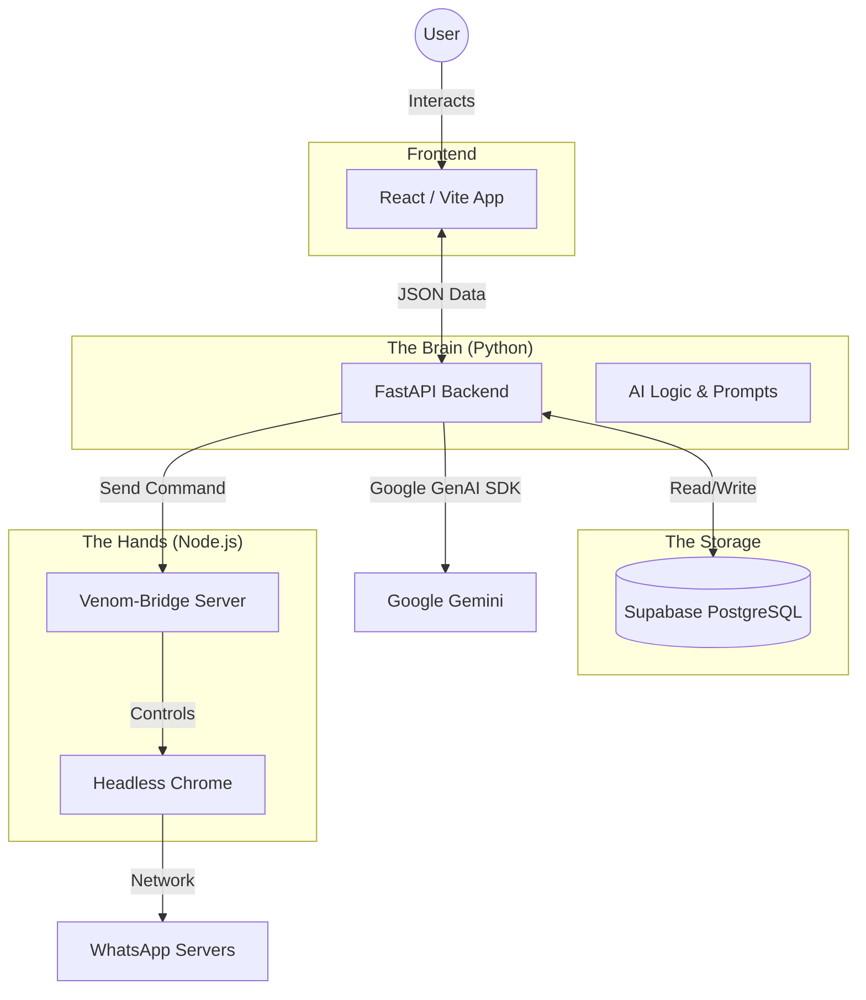

# Shepherd AI - Advanced Church Discipleship System

Shepherd AI is a comprehensive, privacy-first CRM and automation tool designed for church follow-up. It acts as a digital pastoral assistant, tracking the spiritual journey of new converts and automating personal communication via WhatsApp.

---

## ✅ Current Achievements

This project has evolved into a robust, client-side React application with the following capabilities:

1.  **Multi-Provider AI Engine**:
    *   Native support for **Google Gemini** (Free Tier).
    *   Integration with **OpenAI**, **DeepSeek**, **Groq** (Llama 3), and Custom OpenAI-compatible endpoints.
    *   Users can switch providers instantly in Settings.

2.  **Advanced Contact Management**:
    *   Bulk import contacts via Excel (`.xlsx`) or manual CSV text.
    *   Dynamic categorization (New Convert, First Timer, Born Again, + Custom).
    *   Instant search and filtering.

3.  **Context-Aware Generation (RAG)**:
    *   The AI doesn't just write generic text; it references your specific **Knowledge Base** (uploaded books, sermons, manuals).
    *   It understands the user's spiritual journey stage (e.g., "Day 3" vs "Day 30").

4.  **Smart Workflow Automation**:
    *   Built-in logic tracks (Workflows) that automatically calculate which message a contact needs based on their join date.
    *   Supports distinct tracks for New Converts vs. First Timers.

5.  **Comprehensive Scheduling**:
    *   **Bulk Scheduling**: Generate and queue messages for 50+ people at once.
    *   **Individual Scheduling**: Draft a specific message in Live Chat and set it for future delivery.
    *   **Visual Queue**: Manage, edit, or cancel pending scheduled messages.

6.  **Data Sovereignty**:
    *   All data resides in the browser's LocalStorage.
    *   Full JSON Backup & Restore functionality ensures data portability.

---

## 📖 System Architecture & Page Guide

Here is how the different modules of Shepherd AI interconnect to create a seamless workflow:

### 1. Dashboard (`/`)
*   **Function**: The command center providing a bird's-eye view of ministry health.
*   **Interconnections**:
    *   Reads **Contacts** to show distribution charts (Pie Chart).
    *   Reads **Message Logs** to show activity history (Bar Chart).
    *   Reads **Resources** to show knowledge base stats.

### 2. Contacts Manager (`/contacts`)
*   **Function**: The CRM heart of the system. Add, edit, delete, or bulk import souls.
*   **Interconnections**:
    *   **Feeds Campaign Scheduler**: Contacts added here appear in the "Generate & Send" page.
    *   **Feeds Live Chats**: You can search for these contacts in the chat interface.
    *   **Auto-Generation**: When a contact is added, the system can trigger an immediate "Welcome Message" draft in the logs.

### 3. Live Chats (`/chats`)
*   **Function**: A 1-on-1 messaging interface tailored for pastoral care.
*   **Key Features**:
    *   **Chat History**: View the full timeline of AI-generated and manually sent messages.
    *   **Rich Media**: Attach images to messages.
    *   **Scheduling**: Click the *Calendar icon* to schedule a drafted message for later instead of sending immediately.
*   **Interconnections**:
    *   Updates the global **Message Log**, which reflects in the Dashboard.

### 4. Knowledge Base (`/knowledge`)
*   **Function**: The "Brain" of the AI. Upload PDF content, sermon notes, or books (manually or via Excel).
*   **Interconnections**:
    *   **Feeds the AI Service**: When generating messages in *Campaigns* or *Live Chats*, the AI reads these resources to answer spiritual questions or provide context-accurate encouragement.
    *   *Example*: If you upload a sermon on "Faith", the AI can quote it when encouraging a discouraged member.

### 5. Generate & Send (Campaign Scheduler) (`/campaigns`)
*   **Function**: The automation engine. It has three distinct modes:
    *   **Smart Workflows**: The system scans all contacts, checks their "Join Date", compares it to the "30-Day Discipleship Track", and suggests *exactly* what message they need today (e.g., "John is on Day 3, send the Prayer Check-in").
    *   **Manual Draft**: Select specific groups (e.g., "All First Timers"), choose a goal (e.g., "Invite to Sunday Service"), and the AI bulk-writes unique messages for each.
    *   **Scheduled Queue**: A table view of all messages waiting to be sent. You can "Send Now" or "Delete" them here.

### 6. Settings (`/settings`)
*   **Function**: Configuration hub.
*   **Key Features**:
    *   **Identity**: Set the AI's persona (e.g., "Pastor Michael") and Church Name.
    *   **AI Provider**: Switch between Google Gemini, OpenAI, Groq, etc.
    *   **Data Management**: Factory Reset or Restore from Backup.
*   **Interconnections**:
    *   These settings globally affect how the AI speaks and which API key is used throughout the app.

---

## 🏗️ Recommended Backend Architecture

To achieve a production-grade system with data security, advanced AI, and reliable automation, Shepherd AI uses a specific **Hybrid Architecture**.

This architecture solves the "Two Language Problem":
1.  **Python** is best for AI and Logic.
2.  **Node.js** is best for WhatsApp Automation (Venom-bot).

### The Stack



### Component Breakdown

#### 1. The Frontend (React + Vite)
*   **Role:** The User Interface.
*   **Responsibility:** Displays contacts, dashboards, and chat logs. It contains **no business logic**.
*   **Communication:** It talks *only* to the FastAPI Backend. It never touches the Database or WhatsApp directly.

#### 2. The Brain (FastAPI - Python)
*   **Role:** The Central Orchestrator.
*   **Why Python?** Python is the native language of AI. Using FastAPI allows us to eventually integrate advanced frameworks like **LangChain** or **LlamaIndex** for smarter context retention.
*   **Responsibility:** 
    *   Validates user requests.
    *   Generates AI content using Google Gemini.
    *   Saves data to Supabase.
    *   Decides when to send a message via the Node Bridge.

#### 3. The Hands (Node.js - Venom Bridge)
*   **Role:** The WhatsApp Actuator.
*   **Why Node.js?** The library `venom-bot` is built on Node.js and Puppeteer. It is the most stable open-source solution for WhatsApp automation. Python alternatives (like Selenium) are often slower and more brittle for this specific task.
*   **Responsibility:** It runs a small Express server (port 3001) that listens for commands like `{"phone": "123", "message": "hello"}` and executes them in a headless Chrome browser.

---

## 🛠 Tech Stack

*   **Frontend**: React 19 (Hooks, Context API)
*   **Styling**: Tailwind CSS (Responsive, Clean UI)
*   **State Management**: React State + LocalStorage (Persistence)
*   **AI Integration**: `@google/genai` SDK + Standard REST `fetch` for OpenAI/Groq compatibility.
*   **Utilities**: `xlsx` (Excel processing), `recharts` (Analytics), `lucide-react` (Icons).

---

## 🚀 How to Run

### Option A: Standard Frontend (Client-side only)
1.  Clone the repository.
2.  Open terminal and run:
    ```bash
    npm run dev
    ```
3.  Go to **Settings** -> **AI Provider Configuration**.
4.  Enter your API Key (Get a free one from [Google AI Studio](https://aistudio.google.com/) or [Groq](https://console.groq.com/)).
5.  Start adding contacts!

### Option B: Full Hybrid Stack (Recommended)
You need **3 separate terminals** running simultaneously.

#### Terminal 1: The Bridge (Node.js)
```bash
node server/venom-bridge.js
# Runs on http://localhost:3001
```

#### Terminal 2: The Backend (Python)
```bash
cd backend
python -m venv venv
source venv/bin/activate  # or venv\Scripts\activate on Windows
pip install -r requirements.txt
uvicorn main:app --reload --port 8000
# Runs on http://localhost:8000
```

#### Terminal 3: The Frontend (React)
```bash
npm run dev
# Runs on http://localhost:5173
```
# Build: 2025-12-23 22:34

