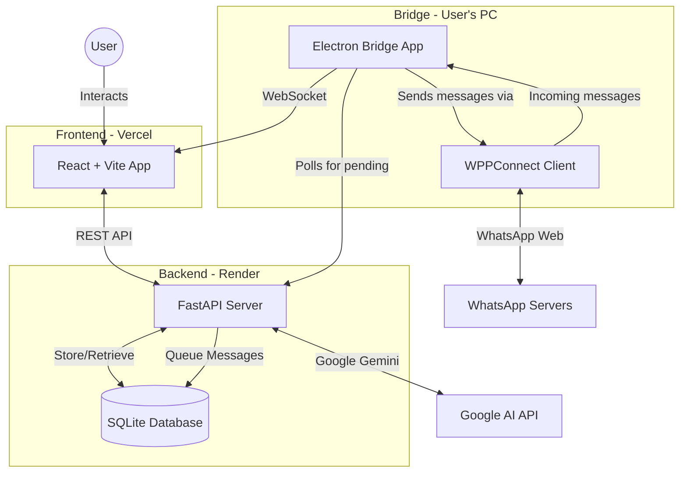

# 🐑 Shepherd AI - Advanced Multi-Industry Engagement & Automation Platform

> **A comprehensive, privacy-first CRM and automation tool for churches, businesses, and organizations. Acts as a digital assistant, tracking customer journeys and automating personalized communication via WhatsApp.**

[](https://shepherd-ai.vercel.app)
[](https://shepherd-ai-backend.onrender.com)

---

## ✨ Features

### 🤖 Multi-Provider AI Engine
- **Google Gemini** (Free Tier) - Default
- **OpenAI** GPT-4 Integration
- **DeepSeek** Support
- **Groq** (Llama 3) Fast Inference
- Custom OpenAI-compatible endpoints
- Instant provider switching in Settings

### 📋 Advanced Contact Management
- Bulk import via Excel (`.xlsx`) or CSV
- Dynamic categorization (New Convert, Customer, Lead, + Custom)
- Instant search and filtering
- Join date tracking for automated workflows
- Full contact history and notes
- Auto-creation from incoming WhatsApp messages

### 💬 Live WhatsApp Messaging
- ✅ **Send messages** directly to WhatsApp
- ✅ **Receive messages** in real-time
- ✅ **Bi-directional communication** with polling architecture
- Rich media support (images, attachments with captions)
- Message scheduling and queuing
- Chat history tracking
- **Two connection methods:**
  - **WPPConnect Bridge** (Free, desktop-based)
  - **WhatsApp Business Cloud API** (Official, cloud-based, mobile-friendly)

### 🧠 Context-Aware AI (RAG)
- Upload sermon notes, books, manuals, product guides
- AI references your specific Knowledge Base
- Understands customer journey stages
- Contextual, personalized responses
- Multi-format support (PDF, DOCX, TXT)

### ⚡ **Custom Workflow Automation** ✨ NEW!
- **Upload custom workflows** via Excel/CSV
- Create unlimited engagement tracks
- **Multi-industry support:**
  - ⛪ Church: 30-Day Discipleship Track
  - 🛍️ E-commerce: Order follow-up sequences
  - 🏘️ Real Estate: Lead nurturing campaigns
  - 💪 Fitness: Member onboarding journeys
  - 📚 Education: Student engagement tracks
  - 💼 Consulting: Client onboarding workflows
- Assign different workflows to different categories
- Day-based automation (Day 0, 1, 3, 7, etc.)
- Bulk message generation and queuing

### 📊 Analytics Dashboard
- Contact distribution charts
- Message activity tracking
- Knowledge base statistics
- Engagement metrics
- Workflow completion rates

---

## 🏗️ System Architecture



### Component Breakdown

#### 1. **Frontend** (React + Vite) - Deployed on Vercel
- User interface for all interactions
- Contact management
- Live chat interface
- Dashboard and analytics
- Settings configuration

#### 2. **Backend** (FastAPI + Python) - Deployed on Render
- Central orchestrator
- AI message generation
- Message queuing system
- Contact and knowledge storage
- Bridge polling endpoints

#### 3. **Bridge App** (Electron + Node.js) - Runs on User's PC
- Local WhatsApp connection via WPPConnect
- Polls backend every 5 seconds for pending messages
- Sends queued messages to WhatsApp
- Forwards incoming messages to frontend
- Maintains persistent WhatsApp session

---

## 🚀 Getting Started

### For End Users

#### 1. **Access the Web App**
Visit: [https://shepherd-ai.vercel.app](https://shepherd-ai.vercel.app)

#### 2. **Create an Account**
- Sign up with email and password
- Set your church name and pastoral identity

#### 3. **Configure AI Provider**
- Go to Settings → AI Provider
- Enter your API key:
  - Get free Gemini key: [Google AI Studio](https://aistudio.google.com/)
  - Or use OpenAI/Groq

#### 4. **Download Bridge App** (For WhatsApp)
- Go to Settings → WhatsApp Integration
- Download the Shepherd AI Bridge (Windows)
- Extract the zip and run `Shepherd AI Bridge.exe`
- Enter your connection code from Settings
- Scan WhatsApp QR code
- Done! Messages now send via your WhatsApp

#### 5. **Create Custom Workflows** ⚡ NEW!
- Navigate to **Workflows** in the sidebar
- Download the template or create your own Excel file with columns: `Day`, `Title`, `Goal`
- Enter a category name (e.g., "Customer Journey", "New Member Track")
- Upload your Excel file
- Assign contacts to that category - they'll automatically follow your custom workflow!

**Example workflow:**
```
Day | Title                 | Goal
0   | Welcome Message       | Send warm welcome
1   | First Check-in        | Ask how they're doing
3   | Share Resource        | Send helpful link
7   | Weekly Update         | Share what's happening
14  | Two-Week Milestone    | Celebrate progress
```

#### 6. **Add Contacts**
- Navigate to Contacts
- Bulk import via Excel or add manually
- Set categories and join dates

#### 7. **Start Messaging!**
- Use Live Chats for 1-on-1 conversations
- Use Generate & Send for bulk messaging
- Schedule messages for future delivery

---

## 💻 For Developers

### Tech Stack

**Frontend:**
- React 19 (Hooks, Context API)
- Vite (Fast build tool)
- Tailwind CSS (Styling)
- Recharts (Analytics)
- Lucide React (Icons)

**Backend:**
- FastAPI (Python)
- SQLAlchemy (ORM)
- SQLite (Database)
- Google Generative AI SDK
- APScheduler (Scheduled tasks)

**Bridge:**
- Electron (Desktop app framework)
- WPPConnect (WhatsApp automation)
- Express (REST API)
- WebSocket (Real-time updates)
- Axios (HTTP client)

### Local Development Setup

#### Prerequisites
- Node.js 18+
- Python 3.9+
- Git

#### 1. Clone Repository
```bash
git clone https://github.com/Teleiosite/shepherd-ai.git
cd shepherd-ai
```

#### 2. Frontend Setup
```bash
npm install
npm run dev
# Runs on http://localhost:5173
```

#### 3. Backend Setup
```bash
cd "Agent File/backend"
python -m venv venv

# Windows
venv\\Scripts\\activate

# Mac/Linux
source venv/bin/activate

pip install -r requirements.txt
uvicorn app.main:app --reload --port 8000
# Runs on http://localhost:8000
```

#### 4. Bridge App Setup (Optional for local testing)
```bash
cd shepherd-bridge-app
npm install
npm start
# Electron app opens
```

### Environment Variables

**Frontend** (`.env`):
```env
VITE_BACKEND_URL=http://localhost:8000  # or production URL
```

**Backend** (`.env`):
```env
DATABASE_URL=sqlite:///./shepherd.db
SECRET_KEY=your-secret-key-here
CORS_ORIGINS=http://localhost:5173,https://shepherd-ai.vercel.app
```

---

## 📖 Usage Guide

### Adding Contacts
1. Go to **Contacts** page
2. Click **"Add Contact"** or **"Import Excel"**
3. Fill in details: Name, Phone, Category, Join Date
4. Save

### Sending Messages

**Live Chat (1-on-1):**
1. Go to **Live Chats**
2. Select a contact
3. Type your message (or let AI generate one)
4. Click Send or Schedule for later

**Bulk Messaging (Campaigns):**
1. Go to **Generate & Send**
2. Select **Smart Workflows** or **Manual Draft**
3. Choose contacts and message goal
4. Review AI-generated messages
5. Send immediately or schedule

### Managing Knowledge Base
1. Go to **Knowledge Base**
2. Click **"Add Resource"**
3. Upload PDF or paste text content
4. AI will reference this when generating messages

### Scheduling System
- **Individual**: In Live Chat, click calendar icon before sending
- **Bulk**: In Campaigns, messages queue automatically
- **Manage**: View and edit all scheduled messages in Queue tab

---

## 🔐 Privacy & Security

- **No Data Collection**: All user data stored in backend database under your control
- **API Keys**: Never stored on servers, only in browser localStorage
- **WhatsApp**: Bridge runs locally on your PC, backend never sees WhatsApp credentials
- **Messages**: Encrypted in transit via HTTPS/WSS

---

## 📦 Deployment

### Frontend (Vercel)
```bash
# Connect to Vercel
vercel

# Set environment variables in Vercel Dashboard:
VITE_BACKEND_URL=https://your-backend.onrender.com
```

### Backend (Render)
1. Connect GitHub repository
2. Set build command: `pip install -r requirements.txt`
3. Set start command: `uvicorn app.main:app --host 0.0.0.0 --port $PORT`
4. Environment variables:
   - `DATABASE_URL`
   - `SECRET_KEY`
   - `CORS_ORIGINS`

### Bridge Distribution
```bash
cd shepherd-bridge-app
npm run build:win  # Windows
npm run build:mac  # macOS

# Upload dist/*.zip to GitHub Releases
```

---

## 🎯 Roadmap

- [x] Multi-provider AI integration
- [x] Contact management with bulk import
- [x] Knowledge base (RAG)
- [x] Message scheduling
- [x] WhatsApp sending (polling architecture)
- [x] WhatsApp receiving (real-time)
- [ ] SMS integration (Twilio)
- [ ] Email campaigns
- [ ] Mobile app (React Native)
- [ ] Multi-language support
- [ ] Advanced analytics and reporting
- [ ] Team collaboration features

---

## 🤝 Contributing

Contributions are welcome! Please:

1. Fork the repository
2. Create a feature branch (`git checkout -b feature/AmazingFeature`)
3. Commit changes (`git commit -m 'Add AmazingFeature'`)
4. Push to branch (`git push origin feature/AmazingFeature`)
5. Open a Pull Request

---

## 📄 License

MIT License - see [LICENSE](LICENSE) file for details

---

## 👨‍💻 Author

**Shepherd AI Team**
- GitHub: [@Teleiosite](https://github.com/Teleiosite)
- Email: support@shepherdai.com

---

## 🙏 Acknowledgments

- **WPPConnect Team** - WhatsApp automation library
- **Google** - Gemini AI API
- **FastAPI** - Lightning-fast Python framework
- **React Team** - Amazing UI library
- **Vercel** - Seamless deployment
- **Render** - Backend hosting

---

## 📞 Support

- **Issues**: [GitHub Issues](https://github.com/Teleiosite/shepherd-ai/issues)
- **Discussions**: [GitHub Discussions](https://github.com/Teleiosite/shepherd-ai/discussions)
- **Documentation**: [Wiki](https://github.com/Teleiosite/shepherd-ai/wiki)

### 📚 Additional Guides

- **[WhatsApp Business Cloud API Setup](./WHATSAPP_BUSINESS_API_SETUP.md)** - Mobile-friendly WhatsApp integration
- **[Custom Workflows Implementation](./CUSTOM_WORKFLOWS_IMPLEMENTATION.md)** - Technical implementation details

---

<div align="center">

**Built with ❤️ for churches, businesses, and organizations worldwide**

⭐ Star this repo if it blessed your ministry!

</div>