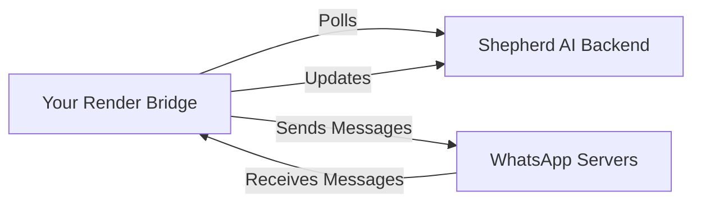

# Shepherd AI Bridge - Cloud Version

This is a cloud-deployable version of the Shepherd AI WhatsApp bridge that runs on Render.

## ☁️ Deploy to Render (One-Click)

[](https://render.com/deploy?repo=https://github.com/Teleiosite/shepherd-ai)

## 🚀 Manual Deployment Steps

### Prerequisites
- A Render account (free tier works!)
- Your Shepherd AI connection code (from Settings page)

### Step 1: Fork This Repository
1. Click "Fork" on GitHub
2. This creates your own copy

### Step 2: Create Web Service on Render
1. Go to [render.com](https://render.com)
2. Click **"New +"** → **"Web Service"**
3. Connect your GitHub account
4. Select your forked repository
5. Select the `shepherd-cloud-bridge` folder

### Step 3: Configure Service

**Build Command:**
```
npm install
```

**Start Command:**
```
npm start
```

**Environment Variables:**
Add these in Render dashboard:

| Key | Value | Description |
|-----|-------|-------------|
| `BACKEND_URL` | `https://shepherd-ai-backend.onrender.com` | Your backend URL |
| `CONNECTION_CODE` | `YOUR_CODE_HERE` | Get from Shepherd AI Settings |
| `PORT` | `10000` | Render's default port |

### Step 4: Deploy!
- Click **"Create Web Service"**
- Wait 2-3 minutes for deployment
- Your bridge is now live 24/7! 🎉

---

## 🔧 How It Works



1. **Bridge runs on Render** (cloud server)
2. **Connects to WhatsApp Web** (headless browser)
3. **Polls backend** for pending messages
4. **Sends via WhatsApp**
5. **Listens for incoming messages**

---

## 🆚 Cloud Bridge vs Desktop Bridge

| Feature | Desktop Bridge | Cloud Bridge |
|---------|---------------|--------------|
| **Cost** | Free | Free (with limits) |
| **Setup** | Download + Run | Deploy to Render |
| **Uptime** | PC must be on | 24/7 automatic |
| **Mobile Access** | ❌ No | ✅ Yes |
| **Updates** | Manual | Automatic |
| **Best For** | Single PC user | Mobile/Team use |

---

## 📊 Render Free Tier Limits

- **750 hours/month** free (enough for 1 month 24/7)
- **Sleeps after 15 min idle** (wakes on request)
- **Unlimited public repos**

**Tip:** Upgrade to $7/month for always-on service.

---

## 🔒 Security Notes

- Your WhatsApp session is stored on Render (encrypted)
- Connection code authenticates with backend
- Never share your connection code
- Render servers are GDPR compliant

---

## 🐛 Troubleshooting

### Bridge shows "offline" in Shepherd AI

**Solution:**
1. Check Render logs for errors
2. Verify `CONNECTION_CODE` is correct
3. Restart the service

### QR Code not scanning

**Solution:**
1. Wait 30 seconds after deployment
2. Check Render logs for QR code
3. Use WhatsApp on phone to scan

### Messages not sending

**Solution:**
1. Verify WhatsApp Web is connected
2. Check backend URL is correct
3. Restart Render service

---

## 🔄 Updating Your Bridge

When we release updates:

1. Sync your fork on GitHub
2. Render auto-deploys (if enabled)
3. Or click "Manual Deploy" in Render

---

## 💰 Cost Estimate

**Free Tier:**
- 750 hours/month = ~31 days 24/7
- Perfect for single user

**Paid Tier ($7/month):**
- Unlimited hours
- Always-on (no sleep)
- Better for businesses

---

## 🆘 Need Help?

- [GitHub Issues](https://github.com/Teleiosite/shepherd-ai/issues)
- [Render Documentation](https://render.com/docs)
- Contact support@shepherdai.com

---

**Happy Shepherding from the Cloud! ☁️🐑**
